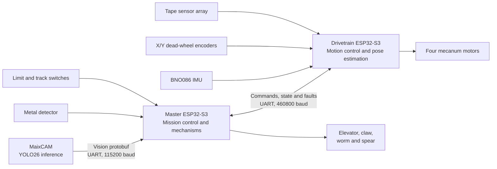

# ENPH 253 2026 — Team 3 Autonomous Robot

Firmware and vision software for Team 3's entry in the 2026 UBC Engineering
Physics Robot Competition.

The robot was built for **ENPH 253: Introduction to Instrument Design**, UBC's
six-week autonomous robotics course. The 2026 competition used a simulated Mars
habitat: robots competed in two-minute heats to find a metal-bearing rock,
assemble a radio tower and habitat, uncover a solar panel, and optionally detect
hidden Teletubby figures. See UBC's
[competition recap](https://engineering.ubc.ca/news/2026/mars-madness-takes-over-annual-ubc-student-robot-competition)
for the full event overview.

This repository contains the complete embedded stack for the two ESP32-S3
controllers, the MaixCAM machine-vision application, shared communication
schemas, hardware drivers, and closed-loop motion-control code.

## Highlights

- Fully autonomous, waypoint-driven competition routine
- FreeRTOS tasks, queues, notifications, and event groups for concurrent control
- Typed, checksummed communication between all three processors
- Four-wheel mecanum drivetrain with robot-relative translation and rotation
- Two-axis dead-wheel odometry fused with a BNO086 IMU
- PID pose tracking with configurable path lookahead
- Multi-sensor tape detection, following, and alignment
- Metal detection for identifying the target rock
- Stepper- and servo-driven elevator, claw, worm, and spear mechanisms
- On-device YOLO26 detection on a Sipeed MaixCAM for the teletubbies, trained on ~1400 labelled pictures

## System Architecture

The workload is split across three processors so that mission planning,
real-time motion control, and computer vision can run independently.



### Master ESP32-S3

The master controller coordinates the autonomous mission. It selects the
competition track, follows predefined waypoint routes, supervises subsystem
state, scans for the metal-bearing rock, consumes camera detections, and
sequences the front-chassis mechanisms. FreeRTOS event groups provide shared
control/status flags, while UART tasks exchange sequenced commands and status
with the drivetrain controller.

The competition routines live in `src/master_esp/main.cpp`; calibrated field
coordinates are defined in `include/master_esp/waypoints.hpp`.

### Drivetrain ESP32-S3

The drivetrain controller owns the time-sensitive motion stack. A 100 Hz loop
combines two quadrature dead-wheel encoders with IMU heading, tracks velocity or
pose references, and mixes robot-frame X/Y/heading commands into four mecanum
motor outputs. Separate tasks handle the IMU, tape sensors, and bidirectional
UART traffic.

`DriveController` supports velocity, absolute/relative pose, tape-follow,
tape-alignment, and stop commands. It also reports pose validity, target
completion, link state, and latched faults to the master controller.

### MaixCAM

The `vision/` application runs a quantized YOLO26 model using MaixPy. It selects
the highest-confidence recognized Teletubby, encodes its class, confidence, and
bounding box as a Protobuf message, and sends it to the master ESP32.
The application also exposes an annotated JPEG preview stream for debugging.
See the [vision system README](vision/README.md) for its pipeline, deployment,
UART protocol, tuning, and troubleshooting details.

### Communications

Messages are described in `lib/comms/proto/` and encoded with Protobuf:

- **Master ↔ drivetrain:** nanopb messages carry drive commands, control flags,
  pose feedback, completion sequence numbers, and faults.
- **MaixCAM → master:** Python protobuf messages carry frame metadata and vision
  detections.
- **Wire framing:** each UART payload is wrapped with a magic value, sequence
  number, payload length, and CRC16-CCITT checksum.

## Repository Layout

```text
.
├── include/
│   ├── master_esp/          # Master-controller interfaces and waypoints
│   ├── drivetrain_esp/      # Drivetrain task and controller configuration
│   └── shared/              # Flags shared by both ESP32 targets
├── src/
│   ├── master_esp/          # Mission, mechanisms, sensing, and supervision
│   └── drivetrain_esp/      # Drive, IMU, tape, UART, and control tasks
├── lib/
│   ├── actuators/           # Elevator/claw and worm/spear abstractions
│   ├── comms/               # UART framing, CRC, nanopb helpers, and schemas
│   ├── control/             # PID, odometry, drivetrain, and tape control
│   ├── drivers/             # DC motor, servo, pulse, and limit-switch drivers
│   ├── filters/             # Signal-processing utilities
│   └── sensors/             # Encoder and metal-detector drivers
├── vision/                  # MaixCAM app, model, UART link, and Python tooling
├── test/                    # PlatformIO/Unity tests
├── docs/                    # Generated Doxygen documentation
├── platformio.ini           # ESP32 build environments and dependencies
└── Doxyfile                 # API documentation configuration
```

## Technology Stack

| Area | Technologies |
| --- | --- |
| Embedded firmware | C++20, ESP32-S3, FreeRTOS, ESP-IDF peripheral APIs / HAL drivers |
| Build and dependency management | PlatformIO, pioarduino ESP32 platform |
| Motion control | Mecanum kinematics, PID control, path lookahead, dead-wheel odometry |
| Sensors | BNO086 IMU, quadrature encoders via ESP32 PCNT, reflectance tape sensors, custom metal detector, limit switches |
| Actuation | PWM DC motor control, FastAccelStepper, hobby servos |
| Communication | UART, Protocol Buffers, nanopb, CRC16-CCITT framing |
| Computer vision | Sipeed MaixCAM, MaixPy, Python, quantized YOLO26 |
| Tooling | Poetry, grpcio-tools, Unity, Doxygen, clang-format |

## Getting Started

### Prerequisites

- [PlatformIO](https://platformio.org/) Core or the PlatformIO IDE extension
- A supported USB connection to each ESP32-S3
- Python 3.13 and [Poetry](https://python-poetry.org/) for vision schema
  generation
- MaixVision/MaixPy tooling to deploy the camera application
- Doxygen (optional) to regenerate API documentation

Clone the repository:

```bash
git clone https://github.com/lew1101/enph-253-2026-team3.git
cd enph-253-2026-team3
```

### Build the ESP32 firmware

Both debug targets are built by default:

```bash
pio run
```

Build an individual controller:

```bash
pio run -e master_esp_debug
pio run -e drivetrain_esp_debug
```

Release environments are also available:

```bash
pio run -e master_esp_release
pio run -e drivetrain_release
```
